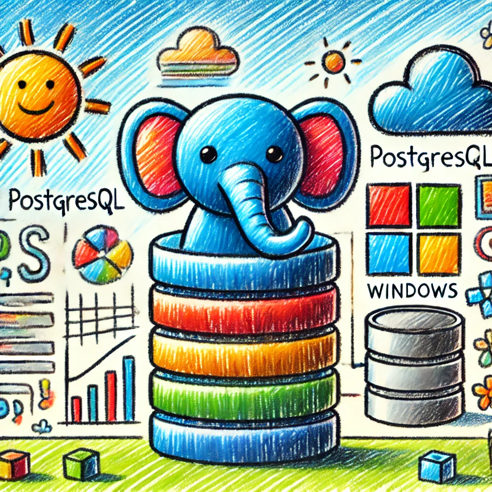

<!-- Title slide: everything centered -->
<!-- _class: title-slide -->
<!-- _header: '' -->     <!-- hide logo on title slide -->
<!-- _footer: '' -->     <!-- hide footer on title slide -->
<!-- _paginate: skip --> <!-- don't count or show page number -->

# Building Reliable Systems with Marp

## AwesomeConf 2025

Jane Doe – @jane

---

<!-- Section subtitle page -->
<!-- _class: section-title -->
<!-- _header: '' -->
<!-- _footer: '' -->
<!-- _paginate: skip -->

# Part I – Motivation

---

<!-- Table of contents slide -->
<!-- _class: toc -->

# Agenda

- Why slides-as-code?
- Marpit / Marp overview
- Custom themes
- Demo
- Q & A

<figure>
  
  <figcaption>
    Architecture overview (adapted from
    <a href="https://example.com/paper">Doe et al., 2024</a>)
  </figcaption>
</figure>

---

<!-- Normal content slide: title in top-left, logo in top-right, footer at bottom -->
# Why slides-as-code?

- Version control for your talks
- Easy reuse between conferences
- Plain text, diffable, reviewable

---

<!-- Content slide with bullets top half, picture bottom half -->
<!-- _class: image-bottom -->

# A typical Marpit pipeline

- Write Markdown with directives
- Apply a custom CSS theme
- Export to HTML / PDF / PPTX

